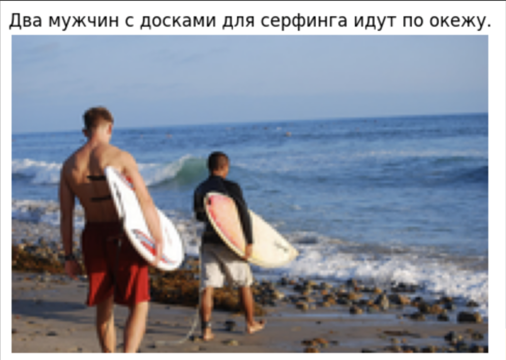

### The research project of the "НАС" team

The research project of the <strong>"НАС" team</strong> (Neural Network Automated System) within the framework of the 'Neural Networks in Machine Learning' course at VK Education involves fine-tuning <strong>ClipCap</strong> using <em>GPT-2</em> tuning, <em>Llama-2</em> tuning, and <em> self-supervised </em> methods.

### Architecture [ClipCap](https://arxiv.org/pdf/2111.09734.pdf)

### Using pretrained models:

+ <strong>CLIP</strong> ViT-B-16-plus-240, "laion400m_e32"  [link](https://github.com/openai/CLIP)
+ <strong>CLIP</strong> ruclip-vit-base-patch32-384  [link](https://github.com/ai-forever/ru-clip)

+ <strong>GPT</strong> sberbank-ai/rugpt3medium_based_on_gpt2 [link](https://github.com/ai-forever/ru-gpts)

### Results

|          LM          | Training data | BLEU-4 on validation data | 
| -------------------- | ------------- |  ------------------------ |
| MLP GPT-2            |   COCO2014    |           43.5            | 
| SA Transformer GPT-2 |   COCO2014    |           45.3            |
| HA Transformer GPT-2 |   COCO2014    |           43.1            |
| Transformer Saiga-2  |   COCO2014    |           36.6            |

### Captions

### Contributors

+ [Beketov Roman](https://github.com/rbeketov/)        |  GPT-2 tuning, evaluation of results

+ [Alexandr Eliseev](https://github.com/Sanchoues)     |  Self-supervised task

+ [Seimchenok Vladimir](https://github.com/VAVASTO)  |  Saiga-2 tuning

+ [Lebedeva Sofia](https://github.com/Sofi0Le)       |  Translation COCO2014 task

### Links

- [ClipCap] (https://arxiv.org/pdf/2111.09734.pdf)
- [Self-supervised ClipCap](https://arxiv.org/pdf/2306.15111.pdf)

